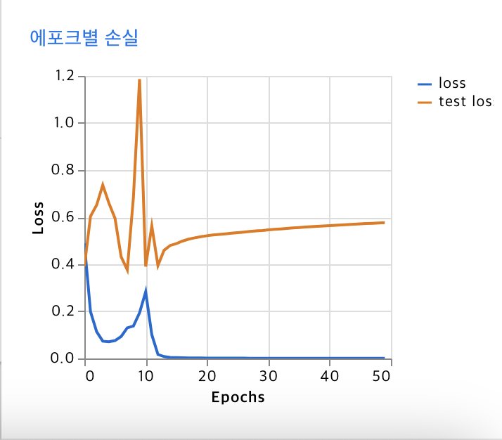
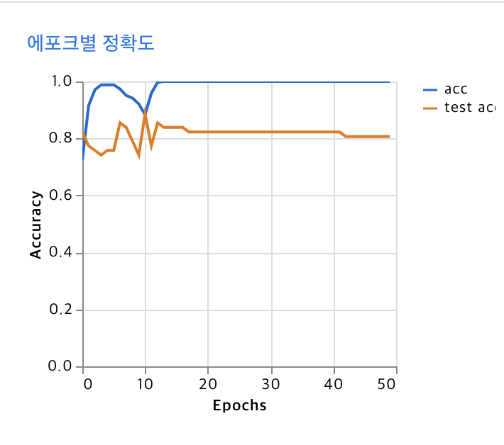

# AI-Generated vs. Human-Created Image Classifier

## Project Overview

This project aims to classify images as either AI-generated or human-created using deep learning techniques. The initial model was trained with a dataset of 100 human-created images and 100 AI-generated images, and its performance was evaluated by analyzing the training and test loss values.

## 프로젝트 개요

이 프로젝트는 이미지를 AI 생성 또는 사람이 만든 것으로 분류하는 딥러닝 모델을 개발하는 것을 목표로 합니다. 초기 모델은 100개의 사람이 만든 이미지와 100개의 AI 생성 이미지로 학습되었으며, 학습 및 테스트 손실 값을 분석하여 성능을 평가했습니다.

## Initial Training Results

After training on the initial dataset:

Training Loss approached 0, indicating that the model was learning the training data very well.

Test Loss remained between 0.4 - 0.6, suggesting potential overfitting.

## 초기 학습 결과

초기 데이터셋으로 학습한 후:

학습 손실(Training Loss) 값이 0에 가까워졌으며, 이는 모델이 학습 데이터를 매우 잘 학습하고 있음을 의미합니다.

테스트 손실(Test Loss) 값이 0.4 - 1.2 사이에 머물렀으며, 이는 과적합(overfitting) 가능성을 시사합니다.

## Addressing Overfitting

To mitigate overfitting, we considered several potential solutions:

Increasing the dataset size (or using Data Augmentation)

Applying Regularization techniques, such as:

L1/L2 Regularization (LASSO, Ridge)

Dropout (randomly disabling neurons during training)

Batch Normalization (to stabilize weight updates)

Early Stopping (stopping training when validation loss starts increasing)

Reducing model complexity (simplifying the architecture)

Increasing batch size (to generalize better over training examples)

## 과적합 해결 방안

과적합 문제를 해결하기 위해 여러 가지 방법을 고려했습니다:

데이터셋 크기 증가 (또는 데이터 증강 사용)

정규화(Regularization) 기법 적용, 예:

L1/L2 정규화 (LASSO, Ridge)

드롭아웃(Dropout) (훈련 중 뉴런 일부 비활성화)

배치 정규화(Batch Normalization) (가중치 업데이트 안정화)

조기 종료(Early Stopping) (검증 데이터 손실이 증가하기 시작하면 학습 중단)

모델의 복잡도 줄이기 (더 단순한 모델 사용)

배치 크기 증가 (일반화를 향상시키기 위해)

### Implementation: Dataset Expansion

After evaluating possible approaches, we opted to increase the dataset size. The dataset was expanded to 3,000 human-created images and 3,000 AI-generated images to improve generalization.

### 데이터셋 확장 적용

여러 접근 방안을 평가한 후, 우리는 데이터셋 크기를 증가하는 방법을 선택했습니다. 데이터셋을 3,000개의 사람이 만든 이미지와 3,000개의 AI 생성 이미지로 확장하여 일반화 성능을 향상시켰습니다.

#### Data Source

The dataset was sourced from Kaggle: AI vs Human-Generated Dataset

#### 데이터 출처

이 데이터셋은 Kaggle에서 가져왔습니다: AI vs Human-Generated Dataset
